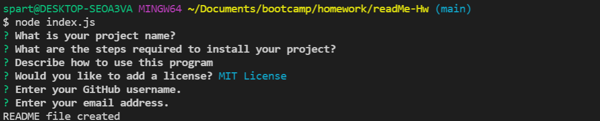

 

# ReadMe Generator

## Description
This project lets you generate a professional README.

## Table of Contents
- [Installation](#installation)
- [Usage](#usage)
- [Credits](#credits)
- [License](#license)

## Installation

 You need to install Node.js and Inquirer.

## Usage

 You need to open the terminal for the 'index.js' then input 'node index.js'.

## License

 MIT License

## Contact me
How to reach me if you have any additional questions.

[GitHub](https://github.com/GustavoTijerino1)

Email: busg26@gmail.com
---
    
    
    